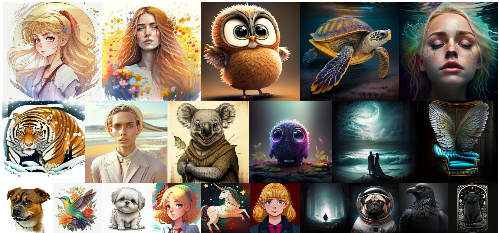
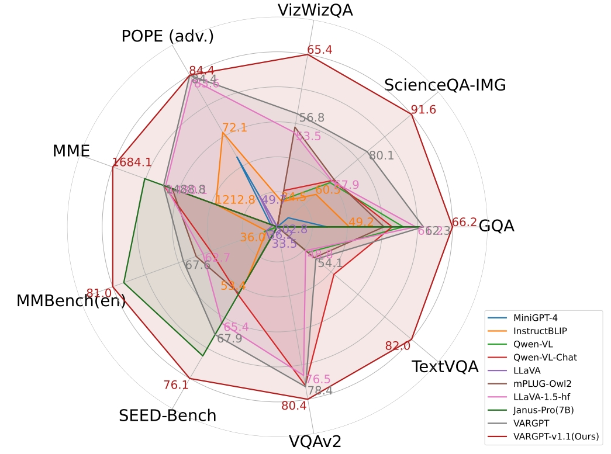
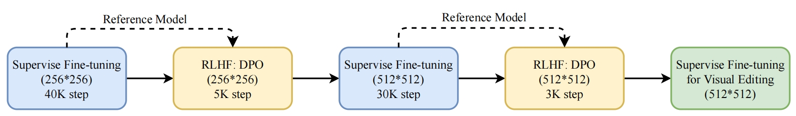
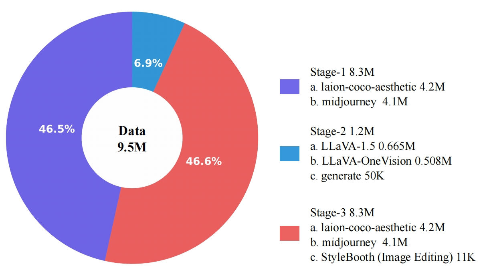

<div align="center">
<br>
<h3>VARGPT-v1.1: Improve Visual Autoregressive Large Unified Model via Iterative Instruction Tuning and Reinforcement Learning</h3>

Xianwei Zhuang<sup>1&#42;</sup>&nbsp;
Yuxin Xie<sup>1&#42;</sup>&nbsp;
Yufan Deng<sup>1&#42;</sup>&nbsp;
Dongchao Yang<sup>2</sup>&nbsp;
<br>
Liming Liang<sup>1</sup>&nbsp;
Jinghan Ru<sup>1</sup>&nbsp;
Yuguo Yin<sup>1</sup>&nbsp;
 Yuexian Zou <sup>1</sup>&nbsp;

<sup>1</sup> Peking University, 
<sup>2</sup> The Chinese University of Hong Kong 
 
[-b31b1b.svg?logo=arXiv)](https://arxiv.org/pdf/xxxx)  
[-b31b1b.svg?logo=arXiv)](https://arxiv.org/pdf/2501.12327) [](https://vargpt1-1.github.io/) [](https://huggingface.co/VARGPT-family/VARGPT-v1.1) [](https://huggingface.co/datasets/VARGPT-family/VARGPT_datasets) [](https://github.com/VARGPT-family/VARGPT/blob/main/LICENSE)
</div>


https://github.com/user-attachments/assets/0b0a9b25-3637-437c-8396-3cc3a5950879


## News


* **[In progress]** The technical report is coming soon. Stay tuned! 
* **[2025-04-2]** We release the more powerful unified model of **VARGPT-v1.1** (**7B+2B**). 🔥🔥

* **[2025-04-1]** We release the **training (SFT and RL) and inference code** of **VARGPT-v1.1 and VARGPT** for multimodal understanding and generation including image captioning, visual question answering (VQA), text-to-image generation and visual editing. 🔥🔥🔥🔥🔥🔥

## What is the new about VARGPT-v1.1?


<p align="center">

</p>
<p align="center">

</p>
Compared with VARGPT, VARGPT-v1.1 has achieved comprehensive capability improvement.
VARGPT-v1.1 integrates: (1) a novel training strategy combining iterative visual instruction tuning with reinforcement learning through Direct Preference Optimization (DPO), (2) an expanded training corpus containing 8.3M visual-generative instruction pairs, (3) an upgraded language backbone using Qwen2, (4) enhanced image generation resolution, and (5) emergent image editing capabilities without architectural modifications.
<p align="center">

</p>
<p align="center">

</p>


<br/>

## TODO
- [X] Release the inference code.
- [X] Release the code for evaluation.
- [X] Release the model checkpoint.
- [X] Supporting stronger visual generation capabilities.
- [X] Release the training code.
- [ ] Release the technical report.


## Hugging Face models and annotations
The VARGPT-v1.1 checkpoints can be found on [Hugging Face](https://huggingface.co):
* [VARGPT-family/VARGPT_v1-1](https://huggingface.co/VARGPT-family/VARGPT-v1.1)

The VARGPT-v1.1-edit checkpoints for visual editing can be found on [Hugging Face](https://huggingface.co):
* [VARGPT-family/VARGPT_v1-1_edit](https://huggingface.co/VARGPT-family/VARGPT-v1.1-edit)


The VARGPT checkpoints can be found on [Hugging Face](https://huggingface.co):
* [VARGPT-family/VARGPT_LLaVA-v1](https://huggingface.co/VARGPT-family/VARGPT_LLaVA-v1)

The instruction for training data can be found on [Hugging Face](https://huggingface.co):
* [VARGPT-family/VARGPT_datasets](https://huggingface.co/datasets/VARGPT-family/VARGPT_datasets)

## Getting Started
First, set up the environment:
```
pip3 install -r requirements.txt
```
If there are difficulties in compilation flash attention, you can directly use wheels for installation
by flash_attn-2.7.3+cu12torch2.1cxx11abiFALSE-cp39-cp39-linux_x86_64 from https://github.com/Dao-AILab/flash-attention/releases.


The description of code structure:
```bash
VARGPTv1.1_code/
├── inference_v1_1           # Inference code for understanding and generation of VARGPT-v1.1.
├── patching_utils      # Patching utils for supporting VARGPT.
├── README.md
├── requirements.txt    # Requirements for inference code.
├── understand_eval     # Evaluation code for understanding.
├── VARGPT-family-training     # Training and Inference code for VARGPT and VARGPT-v1.1 (including SFT and RL).
└── vargpt_qwen_v1_1        # Complete model architecture code of VARGPT-v1.1.

```
### Multimodal Understanding
Inference demo for **Multimodal Understanding**. You can execute the following shell:
```shell
python3 inference_v1_1/understanding_vargpt_v1_1.py
```
Or executing the following code:
```python
# Or execute the following code
import requests
from PIL import Image
import torch
from transformers import AutoProcessor, AutoTokenizer
from vargpt_qwen_v1_1.modeling_vargpt_qwen2_vl import VARGPTQwen2VLForConditionalGeneration
from vargpt_qwen_v1_1.prepare_vargpt_v1_1 import prepare_vargpt_qwen2vl_v1_1 
from vargpt_qwen_v1_1.processing_vargpt_qwen2_vl import VARGPTQwen2VLProcessor
from patching_utils.patching import patching

model_id = "VARGPT-family/VARGPT-v1.1"

prepare_vargpt_qwen2vl_v1_1(model_id)

model = VARGPTQwen2VLForConditionalGeneration.from_pretrained(
    model_id, 
    torch_dtype=torch.float32, 
    low_cpu_mem_usage=True, 
).to(0)

patching(model)

tokenizer = AutoTokenizer.from_pretrained(model_id)
processor = VARGPTQwen2VLProcessor.from_pretrained(model_id)

# Define a chat history and use `apply_chat_template` to get correctly formatted prompt
# Each value in "content" has to be a list of dicts with types ("text", "image") 
conversation = [
    {
      "role": "user",
      "content": [
          {"type": "text", "text": "Please explain the meme in detail."},
          {"type": "image"},
        ],
    },
]
prompt = processor.apply_chat_template(conversation, add_generation_prompt=True)
image_file = "./assets/llava_bench_demo.png"
print(prompt)

raw_image = Image.open(image_file)
inputs = processor(images=[raw_image], text=prompt, return_tensors='pt').to(0, torch.float32)

output = model.generate(
    **inputs, 
    max_new_tokens=2048, 
    do_sample=False)

print(processor.decode(output[0], skip_special_tokens=True))


```
### Multimodal Generation


Inference demo for **Text-to-Image Generation**. You can execute the following shell:
```shell
python3 inference_v1_1/generation_vargpt_v1_1.py
```
Or executing the following code:
```python
import requests
from PIL import Image
import torch
from transformers import AutoProcessor, AutoTokenizer
from vargpt_qwen_v1_1.modeling_vargpt_qwen2_vl import VARGPTQwen2VLForConditionalGeneration
from vargpt_qwen_v1_1.prepare_vargpt_v1_1 import prepare_vargpt_qwen2vl_v1_1 
from vargpt_qwen_v1_1.processing_vargpt_qwen2_vl import VARGPTQwen2VLProcessor
from patching_utils.patching import patching
model_id = "VARGPT-family/VARGPT-v1.1"

prepare_vargpt_qwen2vl_v1_1(model_id)

model = VARGPTQwen2VLForConditionalGeneration.from_pretrained(
    model_id, 
    torch_dtype=torch.float32,     
    low_cpu_mem_usage=True, 
).to(0)

patching(model)
tokenizer = AutoTokenizer.from_pretrained(model_id)
processor = VARGPTQwen2VLProcessor.from_pretrained(model_id)

conversation = [
    {
      "role": "user",
      "content": [
          {"type": "text", "text": "Can you depict a scene of A power metalalbum cover featuring a fantasy-style illustration witha white falcon."},
        ],
    },
]
prompt = processor.apply_chat_template(conversation, add_generation_prompt=True)
print(prompt)

inputs = processor(text=prompt, return_tensors='pt').to(0, torch.float32)
model._IMAGE_GEN_PATH = "output.png"
output = model.generate(
    **inputs, 
    max_new_tokens=4096, 
    do_sample=False)

print(processor.decode(output[0][:-1], skip_special_tokens=True))

```

### Performance Evaluation

Following [lmms-eval](https://github.com/EvolvingLMMs-Lab/lmms-eval) you can install the package by cloning the repository and running the following command:
```bash
cd understand_eval
pip install -e .
```

To evaluate the performance of the model in multimodel understanding, you can execute the following shell:
```bash
python3 -m accelerate.commands.launch \
    --num_processes=8 \
    --main_process_port=39535 \
    -m lmms_eval \
    --model vargpt_qwen2vl_v1_1 \
    --model_args pretrained="path/to/VARGPT_v1-1" \
    --tasks mmmu \
    --batch_size 1 \
    --log_samples \
    --log_samples_suffix llava-hf_mmmu \
    --output_path ./logs/
```


## VARGPT-v1.1 Training Data Preparation
### Instruction Fine-tuning Dataset Download

<p align="center">

</p>

The following content provides detailed instructions for preparing the training data for VARGPT. The data preparation process involves downloading and processing various datasets for different stages of training.

### Dataset Structure

1. `stage1-pt`: Contains 8.3M pre-training instruction fine-tuning dataset for VARGPT-v1.1.

2. `stage2-sft`: Includes datasets for the second stage of VARGPT instruction fine-tuning:
   - `stage2-sft/llava_v1_5_mix665k`: Derived entirely from [LLaVA-1.5](https://huggingface.co/datasets/liuhaotian/LLaVA-Instruct-150K/blob/main/llava_v1_5_mix665k.json) training data.
   - `stage2-sft/llava_onevision_508k`: Sampled from the [LLaVA-onevision Dataset](https://huggingface.co/datasets/lmms-lab/LLaVA-OneVision-Data).
   - `stage2-sft/50k_generation`: Sampled from our 8.3M  dataset.

3. `stage3-sft`: Contains datasets for the third stage of VARGPT-v1.1 instruction fine-tuning from [JourneyDB](https://huggingface.co/datasets/JourneyDB/JourneyDB) and [laion-coco-aesthetic](https://huggingface.co/datasets/guangyil/laion-coco-aesthetic)


## VARGPT-v1.1 Training
Our training code is implemented through [LLaMA-Factory](https://github.com/hiyouga/LLaMA-Factory), so you can follow LLaMA factory to achieve flexible configuration.
### Setting Up
You can follow the training environment with the following command:
```
cd VARGPT-family-training
pip install -e ".[metrics]" torch==2.1.0
```

### Training
You can achieve batch evaluation and training of the model through the corresponding script in `run_scripts`:
- You can perform training SFT using the provided demo dataset and examples:
```shell
cd VARGPT-family-training
bash run_scripts/run_vargpt_qwen2_1_1_sft.sh
```

- You can perform batch evaluations, including evaluations of image generation and image editing:
```shell
cd VARGPT-family-training
bash run_scripts/run_eval_vargpt_v1_1.sh
bash run_scripts/run_eval_vargpt_v1_1_edit.sh
```
### Citation
To cite the paper and model (VARGPT-v1.1 coming soon), please use the below:
```
@misc{zhuang2025vargptunifiedunderstandinggeneration,
      title={VARGPT: Unified Understanding and Generation in a Visual Autoregressive Multimodal Large Language Model}, 
      author={Xianwei Zhuang and Yuxin Xie and Yufan Deng and Liming Liang and Jinghan Ru and Yuguo Yin and Yuexian Zou},
      year={2025},
      eprint={2501.12327},
      archivePrefix={arXiv},
      primaryClass={cs.CV},
      url={https://arxiv.org/abs/2501.12327}, 
}
```
### Acknowledgments
This work is heavily based on [LLaVA-1.5](https://github.com/haotian-liu/LLaVA), [VAR](https://github.com/FoundationVision/VAR), [LLaVA-NeXT](https://llava-vl.github.io/blog/2024-01-30-llava-next), [lmms-eval](https://github.com/EvolvingLMMs-Lab/lmms-eval), [Show-o](https://github.com/showlab/Show-o), [LLaMA-Factory](https://github.com/hiyouga/LLaMA-Factory), [Infinity](https://github.com/FoundationVision/Infinity), [CLIP](https://github.com/openai/CLIP), [transformers-hf](https://github.com/huggingface/transformers). Thanks to all the authors for their great work.
